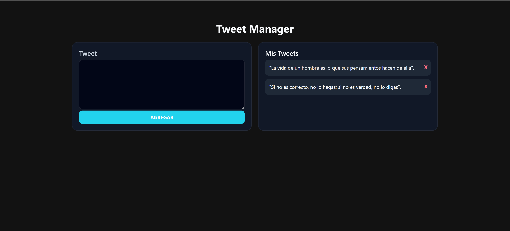
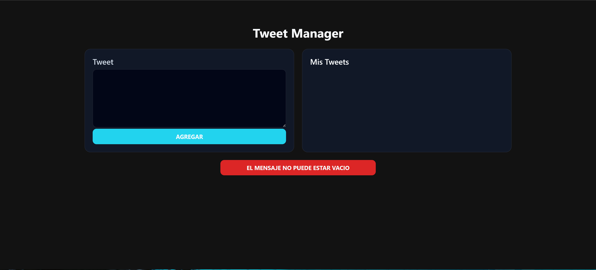

# Tweet Manager

- Simple tweet CRUD application with LocalStorage persistence.

## Live Demo
[View Live Project](https://tweet-app-manager.vercel.app/)

## How to Run Locally

1. Clone the repository:
```bash
git clone https://github.com/siddhartacoder/tweet-app-manager.git
```

2. Open `index.html` in your browser

That's it! No build process required.

## Project Structure 
```
tweet-app-manager/
├── index.html
├── js/
│   └── app.js
├── css/
│   ├── custom.css
│   ├── normalize.css
│   └── skeleton.css
├── img/
│   ├── successful_tweet.png
│   └── error_tweet_blank.png
│
└── README.md
```

----

## Preview

### Successful Tweet Submission


### Error Tweet


## Key Features

- Create and delete tweets
- Data persistence using LocalStorage
- Real-time UI updates without page reload
- Input validation with temporary error messages
- Responsive dark-themed interface

## Built With

- JavaScript (ES6+) for core logic and DOM manipulation
- HTML5 for semantic structure
- CSS3 for styling and layout

## What I Learned

- Persisting data in the browser using LocalStorage
- Dynamically updating the DOM
- Managing application state with arrays
- Structuring small frontend applications
